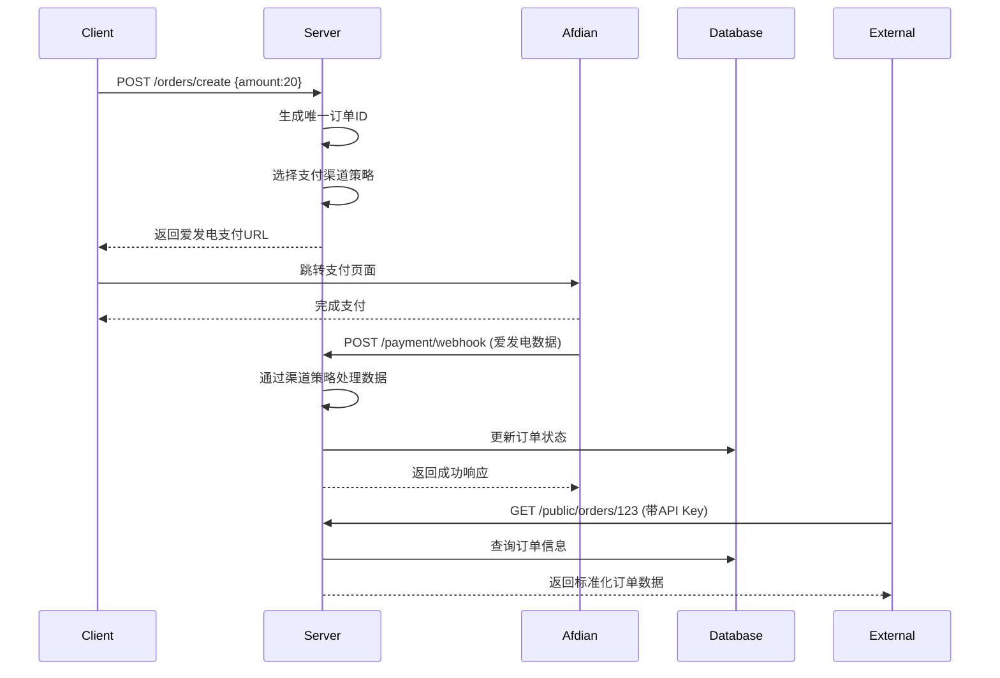

以下是基于 Nuxt.js 3 的全栈开发方案设计（采用最新版本特性）：

---

### 一、项目结构设计
```bash
├── server
│   ├── api
│   │   ├── afdian
│   │   │   ├── webhook.post.ts  # Webhook处理器
│   │   │   └── sync.get.ts      # 主动同步接口
│   ├── middleware
│   │   └── afdian.ts           # 安全验证中间件
├── composables
│   └── useAfdian.ts            # 爱发电逻辑封装
├── components
│   └── Checkout
│       └── PaymentForm.vue     # 支付表单组件
├── pages
│   ├── checkout.vue           # 支付入口页
│   └── orders
│       └── [id].vue           # 订单状态页
└── utils
    └── afdian.ts              # 爱发电SDK核心
```

---

### 二、订单初始化实现

#### 1. 支付表单组件 (components/Checkout/PaymentForm.vue)
```vue
<script setup>
const { $validate } = useNuxtApp()

const form = reactive({
  amount: '',
  months: 1,
  remark: ''
})

async function submit() {
  const { valid } = await $validate(form, rules)
  if (!valid) return
  
  const { data } = await useFetch('/api/orders/create', {
    method: 'POST',
    body: form
  })
  
  if (data.value?.url) {
    window.location.href = data.value.url
  }
}
</script>

<template>
  <form @submit.prevent="submit">
    <input v-model.number="form.amount" type="number">
    <select v-model.number="form.months">
      <option v-for="m in [1,3,6]" :value="m">{{ m }}个月</option>
    </select>
    <button type="submit">立即支付</button>
  </form>
</template>
```

#### 2. 服务端订单创建 (server/api/orders/create.post.ts)
```typescript
export default defineEventHandler(async (event) => {
  const body = await readBody(event)
  
  // 生成唯一订单号
  const orderId = `AF_${Date.now()}_${crypto.randomUUID().slice(0,6)}`
  
  // 保存到数据库
  await prisma.order.create({
    data: {
      id: orderId,
      amount: body.amount,
      status: 'PENDING',
      user_id: event.context.user?.id
    }
  })

  // 构建爱发电URL
  const params = new URLSearchParams({
    plan_id: useRuntimeConfig().afdianPlanId,
    product_type: '0',
    custom_order_id: orderId,
    month: body.months.toString(),
    remark: encodeURIComponent(body.remark || '')
  })
  
  return { 
    url: `https://afdian.com/order/create?${params}` 
  }
})
```

---

### 三、Webhook 处理 (server/api/afdian/webhook.post.ts)
```typescript
export default defineEventHandler(async (event) => {
  const body = await readBody(event)
  
  // 中间件已做签名验证
  const orderData = body.data.order
  
  await prisma.$transaction([
    prisma.order.update({
      where: { id: orderData.custom_order_id },
      data: {
        afdian_id: orderData.out_trade_no,
        status: orderData.status === 2 ? 'PAID' : 'FAILED',
        paid_at: new Date()
      }
    }),
    prisma.webhookLog.create({
      data: { payload: JSON.stringify(body) }
    })
  ])

  return { ec: 200, em: '' }
})
```

---

### 四、主动查询补偿机制

#### 1. 定时任务配置 (使用 Nuxt Cron)
```typescript
// server/plugins/cron.ts
export default defineNitroPlugin(() => {
  const cron = useCron()
  
  cron('*/10 * * * *', async () => {
    const lastSync = await prisma.sync.findFirst({
      orderBy: { created_at: 'desc' }
    })
    
    const params = {
      page: 1,
      per_page: 100,
      start_time: lastSync ? Math.floor(lastSync.created_at.getTime() / 1000) : 0
    }
    
    const { data } = await $fetch('/api/afdian/sync', {
      params
    })
    
    console.log(`Synced ${data.count} orders`)
  })
})
```

#### 2. 同步接口实现 (server/api/afdian/sync.get.ts)
```typescript
export default defineEventHandler(async (event) => {
  const { afdian } = useAfdian()
  const params = getQuery(event)
  
  const result = await afdian.queryOrders({
    page: Number(params.page),
    per_page: Number(params.per_page),
    start_time: Number(params.start_time)
  })
  
  // 批量更新逻辑
  const transactions = result.list.map(order => 
    prisma.order.upsert({
      where: { id: order.custom_order_id },
      update: { 
        status: order.status === 2 ? 'PAID' : 'FAILED',
        afdian_id: order.out_trade_no
      },
      create: {
        id: order.custom_order_id,
        amount: order.total_amount,
        status: 'PAID',
        afdian_id: order.out_trade_no
      }
    })
  )
  
  await prisma.$transaction(transactions)
  
  return { count: result.list.length }
})
```

---

### 五、安全增强方案

#### 1. 全局中间件 (server/middleware/afdian.ts)
```typescript
export default defineEventHandler(async (event) => {
  // IP白名单验证
  if (event.path?.startsWith('/api/afdian')) {
    const clientIP = getRequestIP(event)
    const whitelist = useRuntimeConfig().afdianIPWhitelist
    
    if (!whitelist.includes(clientIP)) {
      throw createError({
        statusCode: 403,
        message: 'IP Not Allowed'
      })
    }
  }
  
  // 签名验证
  if (event.path === '/api/afdian/webhook') {
    const body = await readBody(event)
    const sign = await generateSign(body)
    
    if (sign !== body.sign) {
      throw createError({
        statusCode: 401,
        message: 'Invalid Signature'
      })
    }
  }
})
```

#### 2. 爱发电 SDK 封装 (composables/useAfdian.ts)
```typescript
export const useAfdian = () => {
  const config = useRuntimeConfig()
  
  const generateSign = (params: Record<string, any>) => {
    const sortedParams = Object.keys(params)
      .sort()
      .map(k => `${k}${params[k]}`)
      .join('')
      
    return createHash('md5')
      .update(config.afdianToken + sortedParams)
      .digest('hex')
  }

  const queryOrders = async (params: QueryParams) => {
    const sign = generateSign(params)
    
    return $fetch('https://afdian.com/api/open/query-order', {
      method: 'POST',
      body: {
        user_id: config.afdianUserId,
        params: JSON.stringify(params),
        ts: Math.floor(Date.now() / 1000),
        sign
      }
    })
  }
  
  return { generateSign, queryOrders }
}
```

---

### 六、订单状态页 (pages/orders/[id].vue)
```vue
<script setup>
const route = useRoute()
const { data: order } = await useAsyncData(
  'order',
  () => $fetch(`/api/orders/${route.params.id}`)
)

// 客户端轮询
const { pause, resume } = useIntervalFn(async () => {
  await refreshNuxtData('order')
}, 5000)

watch(
  () => order.value?.status,
  (status) => {
    if (status === 'PAID') pause()
  }
)
</script>

<template>
  <div v-if="order">
    <h1>订单号：{{ order.id }}</h1>
    <p>状态：{{ statusMap[order.status] }}</p>
    <p>金额：¥{{ order.amount }}</p>
    
    <button @click="refreshNuxtData('order')">
      手动刷新
    </button>
  </div>
</template>
```

---

### 七、关键优化点

1. **混合渲染策略**
   - 使用`<ClientOnly>`包裹支付表单组件
   - 订单页采用SSR + 客户端hydration模式

2. **缓存策略**
```typescript
// 订单接口缓存
export default defineEventHandler(async (event) => {
  const id = getRouterParam(event, 'id')
  const order = await prisma.order.findUnique({ where: { id } })
  
  setHeader(event, 'Cache-Control', 'public, max-age=60, stale-while-revalidate=30')
  return order
})
```

3. **错误处理增强**
```typescript
// 全局错误处理器
export default defineNitroPlugin((nitroApp) => {
  nitroApp.hooks.hook('error', (error) => {
    console.error('[Nuxt Error]', error)
    sendToSentry(error)
  })
})
```

---

### 部署建议

1. **推荐平台**
   - Vercel：适合全栈应用
   - Heroku：传统Node.js部署
   - Nuxt专用托管：如Stormkit

2. **配置示例 (nuxt.config.ts)**
```typescript
export default defineNuxtConfig({
  runtimeConfig: {
    afdianUserId: process.env.AFDIAN_USER_ID,
    afdianToken: process.env.AFDIAN_TOKEN,
    public: {
      afdianPlanId: process.env.AFDIAN_PLAN_ID
    }
  },
  
  nitro: {
    preset: 'vercel',
    timing: true,
    storage: {
      orders: { driver: 'redis' }
    }
  }
})
```

3. **性能优化**
   - 使用`<NuxtPage keepalive>`保持页面状态
   - 配置CDN缓存规则
   - 启用Brotli压缩

---

该方案特点：
1. 充分发挥 Nuxt 3 的全栈能力
2. 利用 Composition API 实现逻辑复用
3. 通过 Nitro 中间件实现统一安全控制
4. 混合渲染策略平衡SEO与动态需求
5. 完善的TypeScript类型支持

与Next.js方案的主要差异点：
- 使用Vue生态替代React生态
- 通过Nitro服务器替代Next.js API路由
- 利用Nuxt特有的Auto Imports特性
- 基于useFetch的智能请求处理
- 更简洁的中间件实现方式

实际开发中需要特别注意：
- Vue响应式系统与订单状态的结合
- 服务端客户端渲染边界处理
- Nuxt插件系统的合理使用
- Nitro存储系统的适配

---

### 一、数据库结构升级（以Prisma为例）

```prisma
model Order {
  id               String    @id @default(uuid())  // 系统唯一订单号
  payment_channel  String    @default("afdian")    // 支付渠道标识
  channel_order_id String?   @unique              // 渠道方订单号
  custom_order_id  String    @unique              // 第三方传入订单号
  status           OrderStatus @default(PENDING)
  amount           Decimal
  currency         String    @default("CNY")
  raw_data         Json?                         // 原始支付数据
  metadata         Json?                         // 扩展元数据
  created_at       DateTime @default(now())
  updated_at       DateTime @updatedAt

  @@index([payment_channel])
  @@index([channel_order_id])
  @@index([custom_order_id])
}

enum OrderStatus {
  PENDING
  PAID
  FAILED
  EXPIRED
}
```

---

### 二、支付渠道接入层设计

#### 1. 策略模式实现多渠道支持

```typescript
// utils/payment/channels/index.ts
interface PaymentChannel {
  generatePayUrl(order: Order): Promise<string>
  handleWebhook(data: any): Promise<OrderUpdate>
}

class AfdianChannel implements PaymentChannel {
  async generatePayUrl(order: Order) {
    const params = new URLSearchParams({
      plan_id: config.afdianPlanId,
      custom_order_id: order.id,
      //...
    })
    return `https://afdian.com/order/create?${params}`
  }

  async handleWebhook(data: any) {
    return {
      status: data.status === 2 ? 'PAID' : 'FAILED',
      channel_order_id: data.out_trade_no,
      raw_data: data
    }
  }
}

class PatreonChannel implements PaymentChannel {
  // 实现不同渠道的逻辑...
}

export const paymentChannels: Record<string, PaymentChannel> = {
  afdian: new AfdianChannel(),
  patreon: new PatreonChannel()
}
```

---

### 三、统一订单创建接口

```typescript
// server/api/orders/create.post.ts
export default defineEventHandler(async (event) => {
  const body = await readBody<{
    amount: number
    channel?: string
    custom_id?: string
    metadata?: Record<string, any>
  }>(event)

  // 创建基础订单
  const order = await prisma.order.create({
    data: {
      payment_channel: body.channel || 'afdian',
      custom_order_id: body.custom_id || generateCustomId(),
      amount: body.amount,
      metadata: body.metadata
    }
  })

  // 获取支付跳转URL
  const channel = paymentChannels[order.payment_channel]
  const payUrl = await channel.generatePayUrl(order)

  return { 
    order_id: order.id,
    payment_url: payUrl
  }
})
```

---

### 四、统一Webhook处理器

```typescript
// server/api/payment/webhook.post.ts
export default defineEventHandler(async (event) => {
  const channel = getHeader(event, 'X-Payment-Channel') || 'afdian'
  const processor = paymentChannels[channel]

  const result = await processor.handleWebhook(await readBody(event))
  
  // 更新订单状态
  await prisma.order.update({
    where: { channel_order_id: result.channel_order_id },
    data: {
      status: result.status,
      raw_data: result.raw_data,
      updated_at: new Date()
    }
  })

  return { status: 'OK' }
})
```

---

### 五、订单查询接口设计

#### 1. 公共API路由（需认证）
```typescript
// server/api/public/orders/[id].get.ts
export default defineEventHandler(async (event) => {
  // 验证API Key
  const apiKey = getHeader(event, 'X-Api-Key')
  if (!await validateApiKey(apiKey)) {
    throw createError({ statusCode: 401 })
  }

  const order = await prisma.order.findUnique({
    where: { 
      OR: [
        { id: event.context.params.id },
        { custom_order_id: event.context.params.id }
      ]
    },
    select: {
      id: true,
      status: true,
      amount: true,
      currency: true,
      payment_channel: true,
      created_at: true,
      updated_at: true
    }
  })

  if (!order) throw createError({ statusCode: 404 })

  return {
    code: 200,
    data: {
      ...order,
      amount: order.amount.toNumber()
    }
  }
})
```

#### 2. 安全认证实现
```typescript
// server/middleware/apiAuth.ts
export default defineEventHandler(async (event) => {
  if (event.path.startsWith('/api/public')) {
    const apiKey = getHeader(event, 'X-Api-Key')
    const valid = await verifyApiKey(apiKey)
    
    if (!valid) {
      throw createError({
        statusCode: 401,
        message: 'Invalid API Key'
      })
    }
  }
})
```

---

### 六、文档示例（OpenAPI格式）

```yaml
paths:
  /public/orders/{orderId}:
    get:
      tags:
        - Orders
      parameters:
        - name: orderId
          in: path
          required: true
          schema:
            type: string
      responses:
        '200':
          description: 订单信息
          content:
            application/json:
              schema:
                type: object
                properties:
                  order_id:
                    type: string
                    example: "ORDER_123"
                  status:
                    type: string
                    enum: [PENDING, PAID, FAILED, EXPIRED]
                  amount:
                    type: number
                    format: double
                    example: 20.00
                  payment_channel:
                    type: string
                    example: "afdian"
                  created_at:
                    type: string
                    format: date-time
```

---

### 七、扩展性设计

1. **元数据字段**
   - 存储渠道特殊参数：`metadata`字段可存储各渠道的特殊需求
   ```json
   {
     "webhook_verified": true,
     "promo_code": "SUMMER2024",
     "referrer": "campaign-123"
   }
   ```

2. **渠道配置管理**
   ```typescript
   // utils/payment/config.ts
   export const channelConfigs = {
     afdian: {
       webhookSecret: process.env.AFDIAN_SECRET,
       apiBase: 'https://afdian.com/api'
     },
     patreon: {
       clientId: process.env.PATREON_CLIENT_ID,
       authUrl: 'https://patreon.com/oauth'
     }
   }
   ```

3. **状态映射表**
   ```ts
   const statusMapping = {
     afdian: {
       2: 'PAID',
       3: 'FAILED'
     },
     patreon: {
       'paid': 'PAID',
       'declined': 'FAILED'
     }
   }
   ```

---

### 八、部署注意事项

1. **环境变量管理**
   ```env
   # 支付渠道配置
   AFDIAN_PLAN_ID=your_plan_id
   AFDIAN_WEBHOOK_SECRET=your_secret
   PATREON_CLIENT_ID=your_client_id

   # API安全
   API_KEYS=key1:project1,key2:project2
   ```

2. **数据库迁移**
   ```bash
   # 生成迁移文件
   npx prisma migrate dev --name add_payment_channels
   ```

3. **监控指标**
   - 新增监控点：
     - 各渠道支付成功率
     - Webhook处理延迟
     - 订单状态转换统计

---

该设计方案实现了：
1. 多支付渠道的灵活接入
2. 统一的状态管理和数据存储
3. 安全的对外API接口
4. 良好的扩展性（新增渠道只需添加策略类）
5. 完整的订单生命周期追踪

典型调用流程示例：

